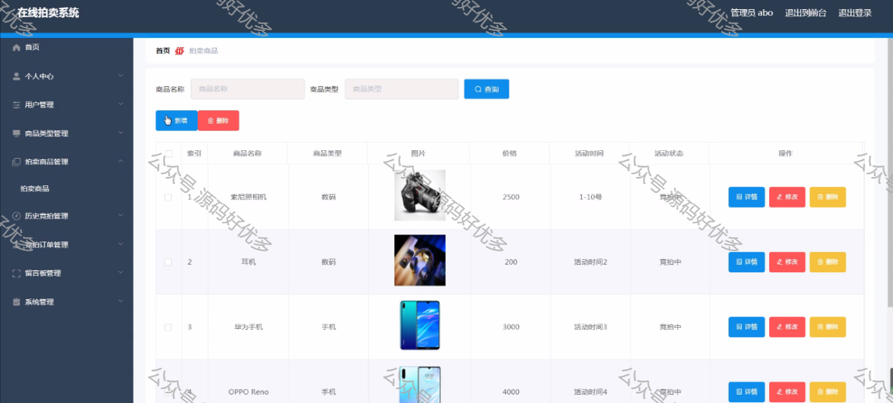

 ## 查看首页获取源码

> **作者介绍**： **✌**全网粉丝10W+本平台特邀作者、博客专家、CSDN新星计划导师、java领域优质创作者,博客之星、掘金/华为云/阿里云/InfoQ等平台优质作者、专注于毕业项目实战 **✌**

  

### 一、作品包含

源码+数据库+设计文档万字LW+PPT+全套环境和工具资源+部署教程

### 二、项目技术

前端技术：Html、Css、Js、Vue、Element-ui

数据库：MySQL

后端技术：Java、Spring Boot、MyBatis

  

### 三、运行环境

开发工具：IDEA/eclipse

数据库：MySQL8.0

数据库管理工具：Navicat10以上版本

环境配置软件： JDK1.8+Maven3.6.3

前端Nodejs：16

  

### 四、项目介绍

项目编号：springboot001

随着社会的发展，社会的各行各业都在利用信息化时代的优势。计算机的优势和普及使得各种信息系统的开发成为必需。

在线拍卖系统，主要的模块包括管理员；首页、个人中心、用户管理、商品类型管理、拍卖商品管理、历史竞拍管理、竞拍订单管理、留言板管理、系统管理，用户；首页、个人中心、历史竞拍管理、竞拍订单管理、留言板管理，前台首页；首页、拍卖商品、竞拍公告、留言反馈、个人中心、后台管理等功能。系统中管理员主要是为了安全有效地存储和管理各类信息，还可以对系统进行管理与更新维护等操作，并且对后台有相应的操作权限。

要想实现在线拍卖系统的各项功能，需要后台数据库的大力支持。管理员验证注册信息，收集的用户信息，并由此分析得出的关联信息等大量的数据都由数据库管理。本文中数据库服务器端采用了Mysql作为后台数据库，使Web与数据库紧密联系起来。在设计过程中，充分保证了系统代码的良好可读性、实用性、易扩展性、通用性、便于后期维护、操作方便以及页面简洁等特点。

本系统的开发使获取在线拍卖系统信息能够更加方便快捷，同时也使在线拍卖系统信息变的更加系统化、有序化。系统界面较友好，易于操作。

### 五、运行截图

  
